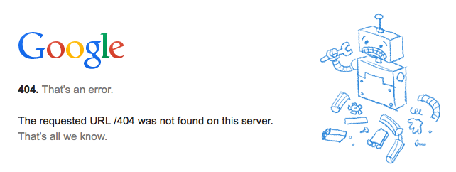

Helaas kom ik nog regelmatig terecht op 404-pagina’s die niet doen wat
zij moeten doen: de bezoeker aangeven **wat** er fout gegaan is en
**hoe** dit probleem snel kan worden opgelost. Het gevolg is dat ik
een website soms verlaat met een gevoel van frustratie en een nieuwe zoektocht op Google begin. 

Jaag jij je bezoekers weg?! Lees de veelgemaakte fouten en oordeel
zelf!

###De 404-pagina bevat technische taal
Een veelgemaakte fout is de weergave "404
Error". Omschrijf de fout liever in heldere en begrijpelijke
taal. Geef aan dat de pagina niet (meer) bestaat en wat de reden hiervan is, namelijk omdat de paginalink is aangepast, verwijderd of verhuisd.

###De gebruiker krijgt het idee de fout te hebben veroorzaakt
Geef de gebruiker niet het idee dat de fout zijn of haar schuld
is. In de meeste gevallen zal de bezoeker namelijk op de foutpagina komen
doordat hij/zij op een link van een externe site heeft
geklikt. Slechts in enkele gevallen tikt de bezoeker het
webadres verkeerd in.

###Weinig sympatie
Een 404-error kan afschrikken of wekt frustratie op. Soms leidt het
zelfs tot irritatie. Laat daarom merken dat je met je bezoeker meeleeft. Bied
hem/haar bijvoorbeeld je excuses aan voor het ongemak. 

###De site leidt de bezoeker automatisch om naar de Homepagina
Bezoekers beseffen zich niet altijd dat zij op een verkeerde pagina
terecht gekomen zijn. Het automatisch omleiden naar de Homepage leidt bij bezoekers daarom vaak
tot verwarring. Daarnaast ontneem je de bezoeker de controle.

###Het gebruik van humor
Natuurlijk kun je een grapje maken. Maak het echter niet te bond. Het
doel van een 404-pagina is namelijk de bezoeker te helpen bij het zo
snel mogelijk vinden van de juiste pagina. Als dit niet lukt, is de
lol er snel van af!

###Zit ik nog wel op de juiste site?!
Een andere veelgemaakte fout is dat de foutpagina er heel anders
uitziet dan de rest van de website. De bezoeker kan hierdoor
het idee krijgen op een totaal andere site beland te zijn.
Natuurlijk mag je laten zien dat het hier om een "speciale" pagina
gaat. Echter, zorg er wel voor dat de foutpagina het bedrijfslogo bevat en dat de
huisstijl is toegepast.

###De foutpagina biedt geen enkele hulp
Het belangrijkste doel van de foutpagina is dat je je bezoekers
helpt bij het vinden van de juiste informatie. Een korte (!) lijst met
links kan hier goed bij helpen.

Zorg er bijvoorbeeld voor dat de hoofd- en footernavigatie op de foutpagina te
zien is. Daarnaast kun je links opnemen naar de meest populaire artikelen of site-onderdelen. Ook een link naar de homepagina is prima. 
Het is bijna onmogelijk om alle pagina's op je site op een lijst te zetten. Naast het aanbieden van een lijstje met links, raad ik je dan
ook aan een zoekfunctie aan de foutpagina toevoegen of eventueel naar de zoekfunctie op je website verwijzen.

###Bezoekers kunnen geen contact met je opnemen
Geef bezoekers de mogelijkheid om contact met je op te nemen, zodat
zij dode links of verdwenen pagina's kunnen melden. Te denken valt aan
een e-mailadres, een live chatsessie of een contactformulier.

 
<small>Bronnen: 
Uxbooth.com (17 maart 2009). <a href="http://www.uxbooth.com/articles/5-tips-to-make-your-404-page-more-usable/">5
tips to make your 404 page more usable</a>. 
Jakob Nielsen (14 juni 1998). <a href="http://www.nngroup.com/articles/improving-dreaded-404-error-message/">Improving
the dreaded 404 error messages</a>. 
Jungleminds.nl (31 augustus 2011). <a href="http://www.nngroup.com/articles/improving-dreaded-404-error-message/">Doe meer met je 404 error! 5
handige tips</a>.

